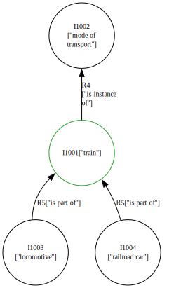

# Introductory Example

In this section, we want to us Pyirk to encode so knowledge about trains,
because I like trains.

## The fundamentals

To make things easier later on, we import pyirk under the alias `p` tell pyirk under 
which `URI` we want to store our knowledge:

```{eval-rst}
.. literalinclude:: trains.py
    :language: python
    :linenos:
    :lines: 1-7
```

For now, just see the rest as boilerplate code, the details can be found [here](URI).

## The Train Item

Alright, so this is about trains. Based on our recently acquired knowledge about knowledge graphs we
now know that our train will be a **Node** in the graph, so we will create an {py:class}`Item <pyirk.core.Item>` for that.
Conveniently, pyirk saves us the hassle to manually instantiate an `Item` object and add some useful relations
like `R1_has_label` or `R2_has_description` with some meaningful date to it.
Instead, we use the function {py:func}`create_item() <pyirk.core.create_item>` which directly allows us to provide some information about 
this new item by making the statement that our new item is connected to the **Literal**
`train` in terms of the relation `has_label` via a keyword argument.
In the same manner, we can also provide an detailed description (via `R2_has_description`):
```{eval-rst}
.. literalinclude:: trains.py
    :language: python
    :linenos:
    :lines: 9-13
```

## Let's add some more hierarchy

As Wikidata says, trains are a mode of transport, which means we will encode this information
by creating another Item:
```{eval-rst}
.. literalinclude:: trains.py
    :language: python
    :linenos:
    :lines: 15-19
```
```{note}
The actual names of the items (`I1` and `I2`) do not matter that much, for this example we will just
assign them growing numbers.
```

However, to make pyirk aware that our train item is indeed a mode of transport, we have to add a relation, in this case
`R4["is_instance_of"]`:
```{eval-rst}
.. literalinclude:: trains.py
    :language: python
    :linenos:
    :lines: 21-22
```
```{hint}
If you are wondering which relation number (like `R4`) will give you the required relation, have a look at
the most common ones in [here](ssec_common_relations).

```

## The parts

Nice. We have our train and know that it is a mode of transportation. But what parts will we need to make one?
The most basic thins would be a locomotive and at least one railroad car, lets get to it:
```{eval-rst}
.. literalinclude:: trains.py
    :language: python
    :linenos:
    :lines: 24-34
```
As we already have our trains item `I1` defined, we can directly add the relation `R5["is_part_of"]` in one
call instead of instantiating the Item and then manually adding it like we did with `I2`, quite nice eh?


## See what we did

So far so good. But how do we check if we defined everything correctly?
Pyirk offers an easy way to visualize a part of your graph by calling 
{py:func}`visualize_entity() <pyirk.visualization.visualize_entity>` which
which will take the `URI` of your entity (in this case of the train item):
```{eval-rst}
.. literalinclude:: trains.py
    :language: python
    :linenos:
    :lines: 36-38
```
The result should look like this:
 
